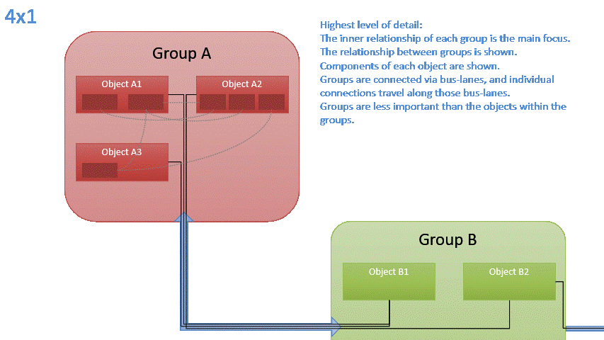
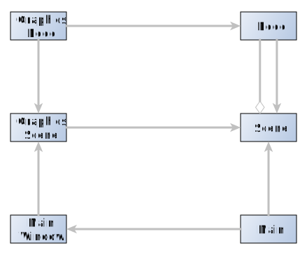

# Multi-level-of-Detail
A graphing application which handles multiple levels of detail.

The intention of this project is to create an application that can handle a graph defined at multiple levels of detail so that you can magnify the detail in and out as you need to.

# Principles
* **Seeing the woods and the trees:** Just like in a map system you can zoom from the street level where you can distinguish trees apart, you can also zoom all of the way out to the continents and countries.
* **Decentralised Editing:** To be able to deal with all of this data we need a way to fragment the file into a set of smaller files each able to describe their small domain, but have a 'super' file which describes how to collate all of the smaller files into a single graph.


## Magnification vs Zoom ##


This applications has a differentiation between magnification and zoom.
Changing the magnification changes the level of detail of the graph. It will inherently change the size of the objects displayed.  
Zoom on the other hand merely changes the size of the rendered objects.


# Components


## Groups and Nodes
The key part of the graph is the group.
A group may contain nodes and other groups.
Each group will have a level (or range of levels) assigned to it. This will determine the level for which it is visible 
and for which it's direct subordinates are visible. Nodes may exist within a group, but may also be standalone. Objects 
which are standalone will, in general, be defined for all levels of detail.


### Node:
A Node is the basic block of the flow. It defines a single piece of functionality


### Group
A Group is a collection of `nodes`, and other `groups`. A Group has ports these are what are used to connect multiple groups together via `conduit`.
When a group is embedded into another group, then that group is treated similar to a node.  


## Connections and Conduits
Groups are connected to other groups via conduits. Objects are connected to other objects via connections. 
The connection between one object in one group and another object in another group must travel through the conduit. 
All connections will bundle together along that conduit. 
The thickness of the conduit is determined by the number of connections traveling along that conduit.


### Connection
An connection represents a data flow between the `sockets` of two `nodes`. Connections should automatically route 
between sockets. A `knot` can tie an connection to a specific point. Connections will normally preferentially route 
along pre-existing conduits


### Conduit
A conduit represents the 'logical' connection between two `groups`. When a conduit is connected to a group which is within another (super) group, and that super-group is connected via a (super) conduit to another super-group, then the conduits will route through the super conduit, and any edges will route through those.


### Knot (possible)
A `knot` will directly connect two (or more) `connections`. A knot can be used to force an connection to route in a specific way, however knots may also be floating.


## Data Interfaces


### Socket:
A socket is ths port which an connection will connect to. The socket will define the data types which are allowable.


### Ports
The point at which a conduit connects to a group is called a port. All connections leaving a group will connect to that port.
A group may have multiple ports along its border, however there are restrictions set for the ports:
* An output port, may only connect to input ports. An output port will only contain one-directional connections leaving the group,
* An input port may only connect the output ports An input port may only contain one-directional connections entering the group,
* A two-way port may only connect to other two way ports. A two-way port may only contain bi-directional connections,
* Non-directional port, can only hold non-directional connections, e.g. a bilateral relationship,
* A open port, may contain any connections types.


## Layout
The hierarchical grouping _should_ allow for simpler layout algorithms.
A layout algorithm should place the highest level groups, and standalone objects first. This will determine the placement of the ports for each group.
The layout algorithm should then recurse into each group placing the constituents of that group and subsequently recursively placing the structure of any subordinate groups. The innermost groups should have the most compact layout.
The algorithms could then back out of the recursion iteratively optimizing the size and layout of each subsequent larger group.

# Files
### Super File:
The super file will link all the sub-group files together

```json
{
    "name": "Main File",
    "ports": [...],
    "groups": [
        {
            "group_name": "Group 1",
            "ports": [
                {
                    "type": "conduit",
                    "id": "4dc46eb1-ce9e-43ca-ad9e-937f40452cb1"
                    "description": "Input String",
                }
            ],
            "sub-groups": [...],  // Same structure as 'groups' above.
            "nodes": [
                {
                    "node id": "d8b3f336-7908-47d0-acdb-6e8feb9fb952",
                    "node name": "Node 1.1",
                    "inputs": [
                        {
                            "type": "socket",
                            "socket id": "56a41165-4fcc-409b-a15e-4fd935968a0f",
                            "socket type": "string",
                            "description": "Input String",
                            "parameter": ""
                        }
                    ]
                },
                {
                    "node id": "d02c61a05-5e85-4a48-8f5b-e5202b5f9575",
                    "node name": "Node 1.2",
                    "inputs": [
                        {
                            "type": "socket",
                            "socket id": "0d756923-ad5f-4e86-9b55-98e08a733e4b",
                            "socket type": "string",
                            "description": "Input String",
                            "parameter": ""
                        }
                    ]
                },

            ],
            "connections": [
                {
                    "id": "",
                    "start": {
                        "node": "d02c61a05-5e85-4a48-8f5b-e5202b5f9575",
                        "socket": "56a41165-4fcc-409b-a15e-4fd935968a0f"
                    },
                    "end": {
                        "group": "e20fc1ff-371e-4e43-8830-5b12d3cd4e04",
                        "node": "56949c62-1adc-46cb-bfda-e570c6d7cd0a",
                        "socket": "327a0763-937b-4e79-89f6-5cacc24e6ee0"

                    },
                    "type" : "straight|bezier",
                    "knots": [...]
                }
            ]
        },
        {
            "group_name": "Group X",
            "ports": [
                {
                    "type": "conduit",
                    // The conduit id must match the id in the group file
                    "id": "e20fc1ff-371e-4e43-8830-5b12d3cd4e04"
                    "description": "Input String",
                }
            ],
            "filepath": "/path/to/the/group-x/definition.json"
        }
    ]

}
```
### A group definition file:
`/path/to/the/group-x/definition.json`
```json
{
    "name": "Group X",
    "ports": [  // These ports must be at least a superset of the ports defined in the super file.
        {
            "type": "conduit",
            // The conduit id must match the id in the super file
            "id": "e20fc1ff-371e-4e43-8830-5b12d3cd4e04",  
            "description": "Input String",
        }
    ],
    "groups": [
        {
            "group_name": "Group X1",
            "ports": [
                {
                    "type": "conduit",
                    "id": "4dc46eb1-ce9e-43ca-ad9e-937f40452cb1",
                    "description": "Input String",
                }
            ],
            "sub-groups": [...],  // Same structure as 'groups' above.
            "nodes": [
                {
                    "node id": "56949c62-1adc-46cb-bfda-e570c6d7cd0a",
                    "node name": "Node X.1",
                    "inputs": [
                        {
                            "type": "socket",
                            "socket id": "327a0763-937b-4e79-89f6-5cacc24e6ee0",
                            "socket type": "string",
                            "description": "Input String",
                            "parameter": ""
                        }
                    ]

                }
            ]
        },
        {
            ...
        }
    ]
}
```